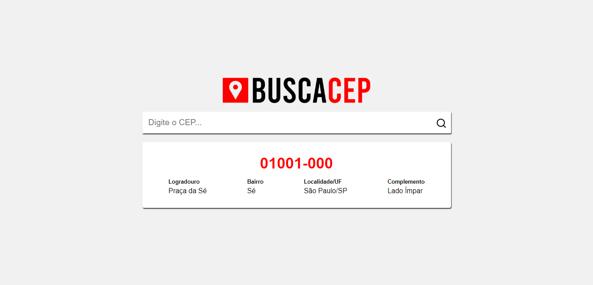

# React Busca CEP

O **React Busca CEP** é uma aplicação que permite a busca de informações detalhadas de endereços a partir de um CEP (Código de Endereçamento Postal). Além disso, a aplicação exibe um mapa interativo da região correspondente, facilitando a visualização e localização do endereço pesquisado.

## Estrutura do Projeto

- **`src/assets`**: Diretório contendo recursos estáticos como imagens, ícones e outros elementos visuais usados no projeto.
  
- **`src/components`**: Contém componentes React reutilizáveis, como o mapa interativo e o modal de mensagens.

- **`src/services`**: Diretório dedicado aos serviços de API, realizando chamadas para buscar informações do CEP e coordenadas de endereço.

- **`src/App.js`**: Arquivo principal que inicializa e organiza a lógica da aplicação, incluindo a interação com o usuário e o mapa.

## Tecnologias Utilizadas

- **HTML**: Para estruturação do conteúdo da página.
- **CSS**: Para estilização dos elementos e layout responsivo.
- **JavaScript**: Linguagem de programação para lógica da aplicação.
- **React**: Biblioteca JavaScript para construção da interface de usuário interativa.
- **Leaflet**: Biblioteca para a geração de mapas interativos e marcação de coordenadas geográficas.

## Funcionalidades

- **Busca de CEP**: Permite ao usuário inserir um CEP e obter informações completas como logradouro, bairro, cidade e estado.
- **Exibição de Mapa**: Ao buscar um CEP, um mapa interativo é gerado, centralizando a região do endereço pesquisado.
- **Exibição de Modal**: Em caso de erro, um modal é exibido com uma mensagem de alerta para o usuário.

## Como Usar

1. Clone o repositório:

```bash
git clone https://github.com/by-scottlucas/react-busca-cep.git
```

2. Navegue até o diretório do projeto:

```bash
cd react-busca-cep
```

3. Instale as dependências:

```bash
npm install
```

4. Inicie o servidor de desenvolvimento:

```bash
npm run dev
```

Isso iniciará a aplicação em `http://localhost:5173`.

5. Abra a aplicação no navegador e insira um CEP para começar a buscar informações de endereço e visualizar o mapa.

## Autor

Este projeto foi desenvolvido por **Lucas Santos Silva**, Desenvolvedor Full Stack, graduado pela **Escola Técnica do Estado de São Paulo (ETEC)** nos cursos de **Informática (Suporte)** e **Informática para Internet**.

## Licença

Este projeto está licenciado sob a [Licença MIT](./LICENSE).

## Acesso

Você pode acessar a aplicação através do seguinte link:

[https://by-scottlucas.github.io/react-busca-cep/](https://by-scottlucas.github.io/react-busca-cep/)

## Imagem do Projeto

